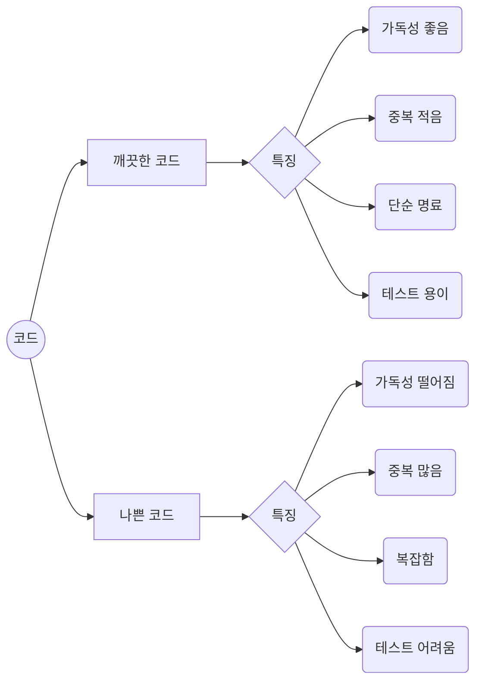
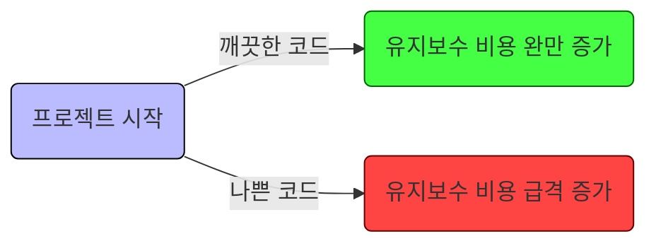
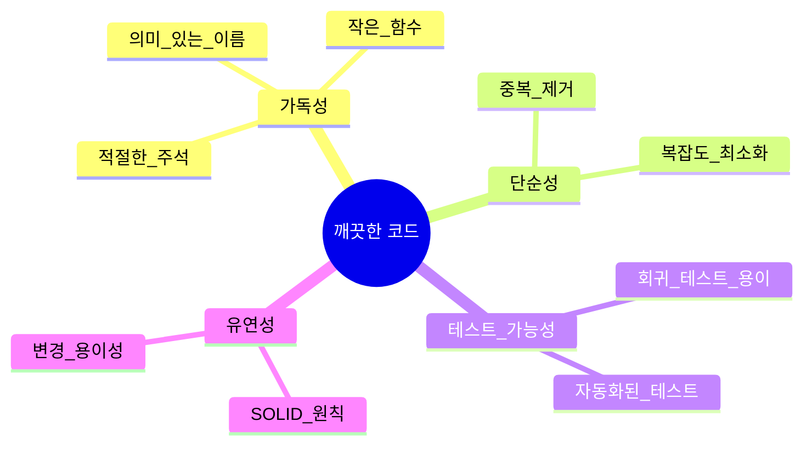

# 1장. 깨끗한 코드

> [!summary] 나의 요약
> 1장에서는 클린 코드 작성을 위한 구체적인 코드 작성 테크닉보다는 전반적인 철학과 태도에 가까운 내용이 많습니다. 저자는 클린 코드가 ‘왜’ 필요한지 역설하며 독자들이 그 맥락을 이해할 수 있도록 다양한 예시를 제공합니다.
> 개인적인 의견이지만 이 맥락, 즉 클린 코드가 필요한 이유를 이해하는 것은 다른 무엇보다 중요합니다. 제 실생활에서의 경험을 예로 들어 보죠.
> 저는 항상 집을 깨끗하게 유지하는 것을 좋아합니다. 제 방을 본 사람들은 제가 청소를 자주 한다고 생각하죠. 물론 예전에는 청소를 자주 했습니다. 그렇게 청소를 자주 하다 보면 청소를 효율적으로 하는 능력이 분명 올라갈 겁니다. 그러나 그보다 더 좋은 이점이 있습니다. 바로 ‘애초에 어지르지 않는 습관’을 얻게 된다는 것입니다. ‘대청소’라는 거창한 작업을 주기적으로 하는 것보다도, 일상 생활에서 작은 단위로 시행하는 정리 정돈과 청소가 훨씬 낫습니다.
> 이런 관점에서 코드를 계속 리팩토링하고 더 ‘깨끗하게’ 유지하는 노력에 대해 다시 생각해 봅시다. 책에서 설명한 여러 가지 이점이 있을 겁니다. 작성한 코드에 가독성, 단순성, 테스트 가능성, 유연성 등을 부여하는 멋진 작업이죠. 그러나 그 노력 이면에 담긴 또 하나의 끝내주는 장점은 ‘애초에 나쁜 코드를 만들지 않는 습관을 기른다’는 것입니다. 최소한으로 어지르고 금방 정리하는 습관이 들면 나의 ‘나쁜 코드’에 대해 ‘대청소’를 감행할 심리적 부담과 업무적 부담을 줄일 수 있습니다.

## 1. 들어가면서

> **핵심 개념**
>
> - **깨끗한 코드(Clean Code)란?** 읽기 쉽고, 변경이 용이하며, 버그를 발견하고 수정하기 쉬운 코드.
> - **나쁜 코드(Bad Code)란?** 가독성이 떨어지고, 중복과 불필요한 복잡도가 많아 수정 및 확장이 어려운 코드.

---

## 2. 깨끗한 코드에 대한 여러 견해

### 2.1 비야네 스트롭스트룹(Bjarne Stroustrup)

- C++의 창시자로, **“코드는 인간이 읽기 위해 작성하고 우연히 컴파일러가 실행하는 것”**이라고 강조합니다.
- 깨끗한 코드는 **“가독성”**과 **“명료함”**을 중시해야 하며, 이는 유지보수성과 직결됩니다.

### 2.2 그래디 부치(Grady Booch)

- 객체지향 소프트웨어 공학 선구자.
- 깨끗한 코드를 작성하기 위해서는 **“설계 원칙과 일관성”**이 매우 중요하다고 역설합니다.

### 2.3 데이브 토마스(Dave Thomas)

- “실용주의 프로그래머”의 저자로 유명.
- 깨끗한 코드란 테스트가 잘 되어 있고, 반복되는 패턴이 최소화되어 있으며, **코드 자체가 문서 역할**을 할 수 있어야 한다고 말합니다.

---

## 3. 왜 깨끗한 코드를 작성해야 할까?

### 3.1 유지보수 비용 절감

- **나쁜 코드**는 시간이 지날수록 유지보수 비용을 기하급수적으로 증가시킵니다.
- 코드가 복잡해질수록, 수정 시 도미노처럼 다른 부분에 영향을 미칩니다.
- **깨끗한 코드**는 이러한 문제를 **사전에 예방**하여, 개발 팀이 더 많은 기능 개발과 개선에 집중할 수 있게 합니다.

### 3.2 협업 효율 향상

- 여러 사람이 함께 작업하는 대규모 프로젝트에서, 팀원 간 **코드 이해**가 곧 생산성으로 직결됩니다.
- 명확하고 표준화된 코딩 스타일, 간결한 함수와 클래스 구조는 **코드 리뷰**와 **협업** 과정에서 갈등이나 실수를 줄여줍니다.

### 3.3 품질 개선 및 사용자 만족도 상승

- 버그가 적고 유지보수가 빠른 코드는 제품 품질을 높이고, 궁극적으로 사용자 만족도로 이어집니다.
- 단순히 외관이나 기능만이 아닌, **코드 레벨**에서의 높은 완성도가 프로젝트 전체 신뢰도를 올립니다.

아래는 시간 흐름에 따른 **깨끗한 코드**와 **나쁜 코드** 프로젝트의 유지보수 비용 변화를 가정한 그래프 예시입니다:

---

## 4. 깨끗한 코드의 특징

### 4.1 가독성(Readable)

- **의미 있는 이름** 사용: `count` 대신 `numOfActiveUsers`처럼 의도를 명확히 드러내는 변수명, 함수명.
- **적절한 함수 크기**: 한 함수가 너무 많은 일을 하지 않도록 분리.
- **명확한 주석**: 주석은 코드를 보완하거나 상황을 예외적으로 설명할 때만 사용. 불필요한 장황한 주석은 오히려 해가 됨.

### 4.2 단순성(Simple)

- 복잡한 로직을 작은 단위로 쪼개어 이해하기 쉽게 구성.
- 중복(Duplication)을 최소화(DRY 원칙 - Do not Repeat Yourself).

> [!info] DRY를 포함한 소프트웨어 개발 3대 원칙
>
> 1.  `KISS` ( Keep It Simple, Stupid) : Keep It Short and Simple, Keep It Small and Simple 비슷한 여러 맥락으로 이해할 수 있습니다. `간단하고 단순한 결과물이 좋다.`는 의미입니다. 설계나 코드가 불필요하게 장황하거나 복잡해지지 않도록 주의할 필요가 있습니다.
> 2.  `YAGNI` ( You Ain’t Gonna Need It) : `야근` 아닙니다. `필요한 작업만 하라.`가 이 원칙입니다. 당장 필요하지 않은 코드를 미리 구현해 둠으로써 예기치 않은 문제가 발생할 원인을 만들지 말라는 의미입니다. 사용되지 않는 기능은 모니터링도 잘 되지 않아서 언제 문제가 터질 지 아무도 모릅니다.

### 4.3 테스트 가능성(Testable)

- 코드 구조를 잘 잡아두면 테스트 코드 작성이 쉬워짐.
- 테스트 자동화가 가능해지면, 코드 개선 시 빠르게 **회귀 테스트**를 진행해 품질을 지킬 수 있음.

### 4.4 유연성(Flexible)

- 깨끗한 코드는 변경 요구사항이 생겼을 때, 최소한의 수정으로도 쉽게 대응할 수 있음.
- **SOLID 원칙**(Single Responsibility, Open-Closed, Liskov Substitution, Interface Segregation, Dependency Inversion)과 같은 객체지향 설계 원칙을 토대로 구현.

---

## 5. 나쁜 코드의 위험성

- **개발 속도 저하**: 초기에는 빨라 보이지만, 시간이 지날수록 유지보수 시간 증가로 인해 전체 개발 속도가 느려짐.
- **버그 증가**: 복잡도가 올라가면 **결합도(coupling)** 가 높아져, 한 부분 수정 시 또 다른 문제가 발생하기 쉬움.
- **프로젝트 실패 가능성 상승**: 일정 지연, 비용 초과 등 악순환이 반복되어 프로젝트가 중단될 위험이 커짐.

---

## 6. Clean Code를 위한 실천 요령

다음과 같은 기본 태도는 Clean Code를 작성하고 유지하는데에 도움이 됩니다.

1. **지속적인 리팩토링**

   - 코드를 작성하는 즉시 깨끗하게 만들기보다는, 계속해서 확인하고 개선하는 과정을 거쳐야 함.

2. **작은 단위로 Commit**

   - 큰 단위로 작업 후에 한꺼번에 수정하려 하면 복잡도가 급증하므로, 가능한 **작은 단위**로 기능을 완성하고 검증.

3. **테스트 주도 개발(TDD)을 권장**

   - 테스트 코드를 먼저 작성한 뒤, 요구사항에 맞춰 코드를 구현하면 **결과물이 자연스럽게 깔끔**해질 확률이 올라감.

4. **코드 리뷰와 협업**

   - 팀원 간의 **코드 리뷰**는 표준화와 지속적 개선에 큰 도움을 줌.
   - 자신이 이해하기 쉬운 코드가 남도 이해하기 쉽다는 보장은 없으므로 리뷰를 통해 보완해야 함.

---

## 7. 참고 자료

- Robert C. Martin, _클린 코드_, 인사이트, 2013.
- Andy Hunt, Dave Thomas, _실용주의 프로그래머_, 인사이트, 2014.
