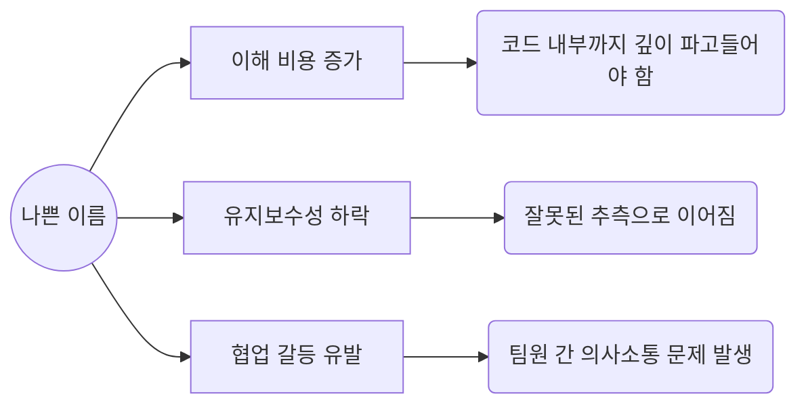
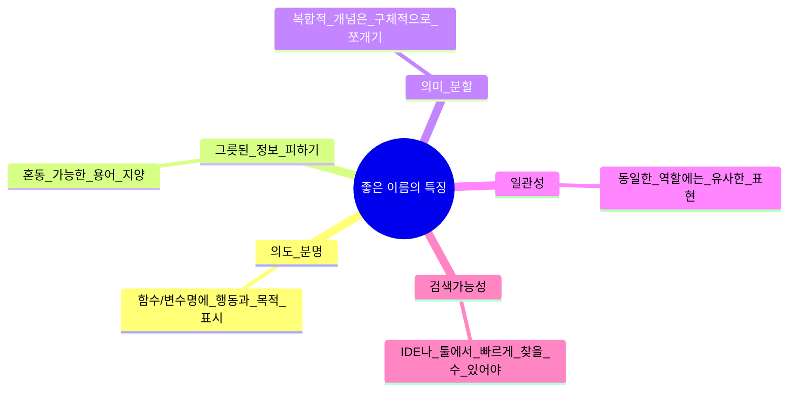

# 2장. 의미 있는 이름

> “좋은 이름은 작은 설계 문제를 푸는 것이다.” – 로버트 C. 마틴

> [!summary] 나의 요약  
> 우리가 직관적으로 이해할 수 있는 UI를 선호하듯, 코드도 읽는 순간 바로 의도를 파악할 수 있어야 합니다. UX 심리학에서는 사용자가 불필요한 인지적 부담 없이 정보를 이해하도록 돕는 것이 핵심 원칙인데, 이는 코드에도 동일하게 적용됩니다.  
> 저자는 “좋은 이름을 짓는 것은 작은 디자인 문제”라고 강조하며, 가독성이 뛰어난 코드는 불필요한 주석을 줄이고 협업과 유지보수를 원활하게 만든다고 설명합니다.  
> 이 장에서는 나쁜 이름이 가독성을 해치는 방식과 함께, 의미 있고 직관적인 이름을 선택하는 구체적인 원칙을 다룹니다. 결국, 코드도 하나의 사용자 경험(UX)이며, 읽는 이가 즉각적으로 이해할 수 있도록 설계해야 한다는 점을 강조하는 것이 핵심입니다.
> 추가적으로 이런 원칙을 이해하기 위해서 인지 심리학과 관련된 여러 이론을 습득하는 건 장기적인 관점에서 큰 자산이 될 거라고 생각합니다.

---

## 1. 들어가며

> 코드에서 가장 자주 눈에 띄는 요소가 **이름**입니다. 변수명, 함수명, 클래스명, 패키지명 등 이름이 끊임없이 등장하죠.  
> 하지만 **의미 없는 이름**은 가독성을 해치고 협업 효율성을 떨어뜨립니다. 반면, **의도를 명확히 드러내는 이름**은 코드 이해를 훨씬 수월하게 만들어 줍니다.

---

## 2. 나쁜 이름이 초래하는 문제

### 2.1 이해 비용 증가

- 이름에 의도가 드러나지 않으면, 코드를 읽는 사람은 실제 동작을 이해하기 위해 **코드 내부 구조**까지 깊게 파고들어야 함.
- 간단한 로직이라도 이름이 불명확하면 **의미 파악**에 시간이 걸림.

### 2.2 유지보수성 하락

- 혼동을 야기하는 이름(약어 남용, 의미가 모호한 이름)은 수정 시 의도와 다르게 변경될 위험이 큼.
- 코드를 분석할 때, 엉뚱한 추측을 하게 만드는 경우가 발생하기 쉬움.

### 2.3 협업 갈등 유발

- 팀 내에서 “이 변수는 뭘 의미하지?”라는 질문이 자주 나오면, 코드 리뷰나 협업 시에 불필요한 마찰이 생김.
- 동일한 개념을 여러 가지 혼동스러운 이름으로 부르다 보면, 커뮤니케이션 비용이 올라감.

---

## 3. 좋은 이름의 특징

### 3.1 의도를 분명히 드러내기

- **함수명, 변수명**에 “왜 존재하는지, 무슨 일을 하는지”가 드러나도록 작성
- `getActiveAccounts()` vs `getData()`: 후자는 모호해 의도를 알기 힘듦

### 3.2 그릇된 정보를 피하기

- 보통 업계나 프로그래밍 언어에서 특정 의미가 이미 굳어진 단어(`temp`, `obj`, `data`)는 혼동을 일으키지 않도록 주의
- `list`라는 이름을 써 놓고 실제로는 배열(Array) 구조를 쓰거나, `accountList`라고 했는데 `Map`인 경우 등이 대표적

### 3.3 의미를 분할하기

- 여러 개념이 한꺼번에 들어있는 이름은 쪼개서 사용 (예: `address` 대신 `mailingAddress`와 `billingAddress`로 구체화)
- 이름이 너무 길어지더라도 의도가 뚜렷해지면 오히려 명확성이 올라감

### 3.4 일관성을 유지하기

- 비슷한 역할을 하는 함수나 클래스는 유사한 패턴으로 이름 짓기
- `getUserById()`, `getUserByEmail()` 같이 명확한 패턴을 사용
- 단, `fetchUser()`, `retrieveUser()`처럼 제각각이면 헷갈릴 수 있음

### 3.5 검색 가능성 (Searchability)

- 코드 베이스가 커질수록, 찾기 어려운 이름(예: `k`, `i`)을 쓰면 IDE로도 쉽게 검색되지 않음
- 적절한 키워드를 사용한 이름이면 **팀원 전체**가 빠르게 검색 가능

---

## 4. 이름 짓기 실전 팁

1. **도메인 지식 활용**

   - 업무(도메인)에 특화된 용어를 적극 활용하되, 해당 용어가 팀 내에서 공통으로 이해되는지 확인

2. **축약보다는 의미 유지**

   - 글자 수보다 명확성이 더 중요
   - `calcInt`보다는 `calculateInterest`가 더 이해하기 쉬움

3. **함수 이름에는 동사, 클래스 이름에는 명사**

   - `getActiveUserList()`, `updateAccount()` 같이 함수에는 행동을 나타내는 단어를 사용
   - 클래스나 객체에는 `User`, `AccountManager`처럼 명사 또는 명사구

4. **발음하기 쉬운 이름**

   - 사람 간 구두로 의논할 때도 어렵지 않도록 하며, 머리속으로 읽고 이해하기 쉬운 이름을 선정
   - `genAccRpt` 보다는 `generateAccountReport`가 낫다

5. **의도를 드러내는 단어 사용**

   - `flag`, `temp`처럼 의미가 불분명한 단어는 대체하는 것을 권장
   - 예) `temp` -> `temporaryUserData`, `flag` -> `isActive` 등

---

## 5. 이름 변경에 대한 두려움 버리기

- **리팩토링 과정**에서 가장 간단하면서도 효과적인 작업 중 하나가 바로 ‘이름 변경’
- 이름이 모호하다고 느껴지면 망설이지 말고 변경: 깔끔한 코드를 향한 첫걸음
- IDE 리팩토링 기능을 활용하면, 안전하게 여러 위치를 동시에 변경 가능

---

## 6. 다른 챕터와의 연관성

- **3장 함수**, **4장 주석** 등 이후 장들의 내용에서도 이름 짓기는 중요한 역할을 함
- 예를 들어, 주석으로 설명해야 할 부분을 **이름**으로 드러내면 주석 자체가 줄어들어 코드가 더욱 간결해짐
- 함수가 적절한 이름을 갖추면, 그 자체로 **동작과 의도**를 설명하게 됨

---
