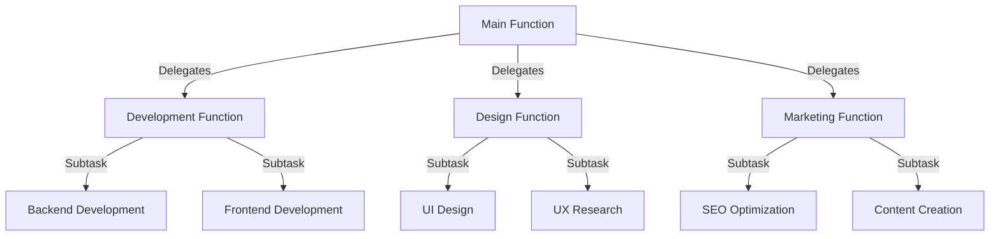
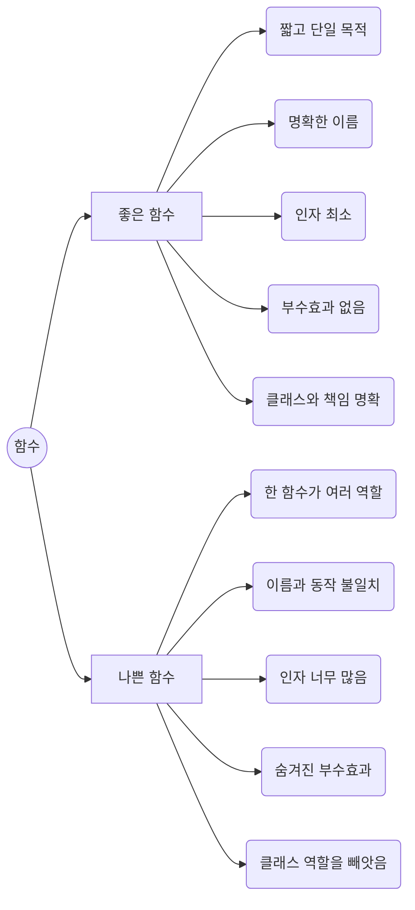
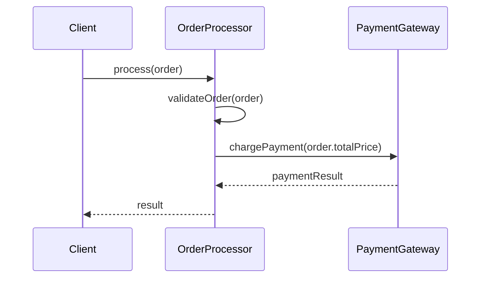

# 3장. 함수

> “작고, 단일 목적을 수행하며, 가독성이 높은 함수는 클린 코드의 핵심이다.” – 로버트 C. 마틴

> [!summary] 나의 요약  
> **3장**은 함수(Functions)를 어떻게 작성해야 클린 코드에 부합하는지 집중적으로 다룹니다.  
> 저자는 “함수는 작고, 한 가지 일만 해야 한다”고 강조합니다. 한 가지 목적을 가진 작은 함수들이 모여 결합도가 낮고 유지보수가 용이한 코드 구조를 만들 수 있기 때문이죠.  
> 이때 객체지향 프로그래밍(OOP)의 모듈화 원칙과도 자연스럽게 연결되는데, **‘모든 것을 함수로 나누려 애쓰기보다, 적절히 클래스로 묶고 역할을 분리하는 것’**이 중요합니다. 코드 베이스가 커질수록 ‘짧고 명확한 함수’와 ‘적절히 분리된 객체 구조’가 함께 시너지를 내어 높은 응집도와 낮은 결합도를 달성할 수 있습니다.  
> 결국, 함수가 무엇을 ‘의미’하는지 이름과 내용으로 드러내고, 필요한 만큼만 책임지도록 만들면 전체 코드를 이해하기 쉬워지며 유지보수성이 극대화됩니다.
> 회사를 떠올려보세요. 한 사람이 기획, 개발, 디자인, 마케팅까지 모두 맡는다면 어떻게 될까요? 업무가 과중되고 실수할 확률이 높아지겠죠. 그 사람이 갑자기 번-아웃이 와서 출근을 못 한다면? 회사의 모든 기능이 마비할 것입니다. 함수도 마찬가지입니다.
> 결국, 함수는 조직 내 개별 역할을 수행하는 직원(개별 역할만 하는 직원일 수록 AI가 대체하기 쉽다는 말은 안 비밀…)과 같습니다. 적절한 책임을 부여하고, 협업할 수 있도록 구조화하면 전체 코드베이스가 이해하기 쉬워지고 유지보수성이 극대화됩니다.

---

## 1. 들어가며

> 함수는 프로그래밍의 기본 단위 같지만, 그 형태에 따라 **프로그램 전체 구조**가 달라집니다.  
> “함수가 적절하게 작성되었는가?”는 코드 가독성, 유지보수성, 확장성에 걸쳐 엄청난 영향을 미치죠.  
> 그리고 이 함수들이 모여 **클래스**를 구성하고, 클래스들이 모여 **모듈**과 **시스템**을 이룹니다.  
> **‘함수를 잘 짜는 것’**은 곧 **‘객체지향 프로그래밍에서 적절히 모듈화하는 것’**과도 맥을 같이 합니다.

---

## 2. 좋은 함수 vs 나쁜 함수

### 2.1 좋은 함수의 특징

- **작다(Small)**: 한눈에 들어올 정도로 짧고, 하나의 명확한 목적을 수행
- **의도가 분명하다**: 함수명과 내부 로직이 일치하며, 무엇을 하는지 바로 이해 가능
- **입력 인자가 적다**: 최소한의 파라미터로 구성되어, 함수를 사용하는 입장에서 부담이 적음
- **부수효과(Side Effect)가 없다**: 가능하다면 입력값을 바꾸지 않고, 전역 상태를 건드리지 않도록 설계
- **객체지향 원칙에 부합**: 함수가 너무 많은 데이터를 다루거나, 클래스가 맡아야 할 책임을 대신하지 않는지 주의

### 2.2 나쁜 함수의 특징

- **여러 가지 역할을 동시에 수행**: “한 함수 안에 순서가 중요한 로직이 길게 나열”되거나 중복된 로직이 섞여 있음
- **이름과 내용이 불일치**: 함수명은 단순히 `calculate()`인데, 내부에서 파일 I/O부터 DB 쿼리까지 수행
- **너무 많은 인자를 요구**: 인자 리스트가 길면 길수록 함수 호출부에서 헷갈리기 쉬움
- **숨겨진 부수효과**: 의도치 않게 전역 값 변경, 다른 객체의 상태를 몰래 바꾸어 의도 파악이 어려움
- **클래스의 역할 침범**: 함수가 특정 클래스로 묶어야 할 데이터를 분산 처리하거나, 객체지향 원칙에 반하는 구조

---

## 3. 함수를 설계하는 기본 원칙

### 3.1 작게 만들어라 (Small)

- 함수를 작게 만들수록, 읽기도 쉽고, 잘못된 부분을 찾거나 수정하기도 편함
- “한 함수가 여러 일”을 하는 것 같다면 과감히 분리할 수 있는 지점을 모색

### 3.2 한 가지 일을 하라 (Do One Thing)

- 단일 책임 원칙(SRP, Single Responsibility Principle)에 부합
- 여러 책임이 섞여 있는지 확인: “읽기 + 파싱 + 데이터 검증 + DB 저장”을 한 함수에서 하지 않도록 주의

### 3.3 의미 있는 이름과 서술형 함수명

- 함수명만으로도 “무슨 일을 하는지” 파악하게끔 작성 (2장에서 학습한 ‘의미 있는 이름’과 연관)
- `convertFileToJson()`처럼 **입력 대상**과 **출력 목적**이 함께 드러나면 더욱 명확

### 3.4 최소한의 인자 개수

- **인자 3개 이상**이면 구조를 재검토 (가독성 & 테스트의 복잡도 상승)
- 복합 데이터는 **객체**나 **DTO**로 묶어 의미를 명확히 표현

### 3.5 중복 배제 (DRY 원칙)

- 반복되는 로직은 별도 함수로 추출해 재사용
- 중복 로직을 줄이면 수정 시 여러 곳을 동시에 손볼 필요가 없으므로 유지보수성 향상

---

## 4. 객체지향 프로그래밍(OOP) 모듈화와 함수

### 4.1 고 Cohesion, 저 Coupling

- **함수 단위**만 깔끔해도 코드는 한결 낫지만, 한 단계 더 나아가 **클래스의 응집도(Cohesion)** 를 높이는 것이 중요
- 서로 관련이 깊은 함수와 데이터는 **하나의 클래스** 안에 배치해 모듈화

### 4.2 객체로 책임 분산

- **하나의 함수가** 너무 많은 일을 하고 있다면, 사실상 **새로운 객체**가 필요한 신호일 수 있음
- 예: `processAllOrders(orders, discountRate, globalConfig)` 같은 거대 함수 대신, `OrderProcessor` 클래스를 만들어 책임을 분산

<a href =".\Reference\git-checkout-책임분산.md">>[!info] 실제 사례로 보는 책임 분산(Git checkout의 분화)</a>

### 4.3 협력(Interaction) 관점에서 함수 바라보기

- 함수는 객체 간의 ‘메시지(메서드 호출)’로 볼 수 있음
- 협력 다이어그램(Sequence Diagram) 등을 활용해 “어떤 객체가 누구에게 무엇을 요청하고, 어떤 결과를 반환하는지” 시각화하면 책임 분리가 더욱 명확해짐

#### 예시: Sequence Diagram

- `OrderProcessor` 내부 함수들은 **“단일 목적(주문 처리)”**에 집중하며, 세부 책임(검증, 결제 요청 등)을 필요한 곳에 적절히 위임

### 4.4 클래스 vs 함수: 언제 객체가 필요한가?

- **함수 인자가 지나치게 많거나**(4개 이상) 로직이 방대해지면, 해당 로직에 맞는 **클래스/구조체**를 고려
- 비즈니스 로직이 “데이터 + 로직” 형태로 잘 묶여 있다면, 함수보다는 **객체 메서드**가 더욱 직관적일 수 있음
- **“함수를 작게, 모듈은 명확하게”** 유지하는 것이 객체지향의 궁극 목표

---

## 5. 함수 작성 시 주의사항

### 5.1 함수는 명령과 조회를 분리하라 (Command-Query Separation)

- **Command**: 무언가를 수행(변경)
- **Query**: 무언가를 반환(읽기)
- 한 함수가 동시에 두 역할을 하면 가독성을 해치고 테스트도 복잡해짐
- 객체지향 관점에서도, “조회” 메서드와 “변경” 메서드를 구분해 인터페이스를 설계하면 클래스 응집도에 유리

### 5.2 예외 처리(오류 핸들링)는 독립적 책임으로

- 예외 처리 로직이 복잡하다면 별도 함수나 별도 클래스로 분리
- 코드 길이가 늘어나면 가독성이 떨어지므로, **try-catch** 블록을 “핵심 로직”과 분리해서 읽기 편하게 정리

### 5.3 테스트 자동화와 Mock 활용

- 함수가 DB, 파일, 네트워크 등 외부 의존성이 많다면, 테스트가 어려워짐
- 객체지향 원칙을 적용해 **인터페이스(Interface)나 추상 클래스**로 의존성을 분리하면 **Mock** 테스트로 빠르게 검증 가능
- 작고 명확한 함수는 테스트 코드도 간결해짐

### 5.4 추가 아이디어? 함수 ‘경량 객체’화

- 함수를 단순히 “로직을 모아놓는 그릇”으로만 보지 않고, **경량 객체**로서 생각해볼 수도 있음
- 예: **Strategy** 패턴처럼, 특정 기능(함수 로직)을 캡슐화하여 **객체**로 주입하면, 함수 교체를 유연하게 수행 가능
- 이렇듯 “함수 자체를 객체화”하는 관점이 코드 확장과 재사용성을 극대화할 때 꽤 유용

---
