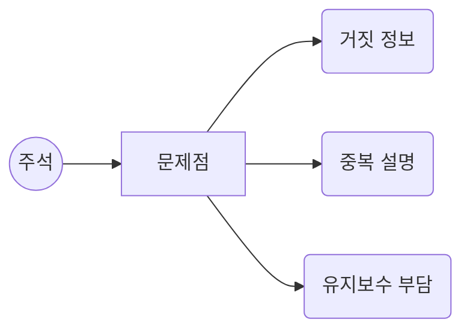
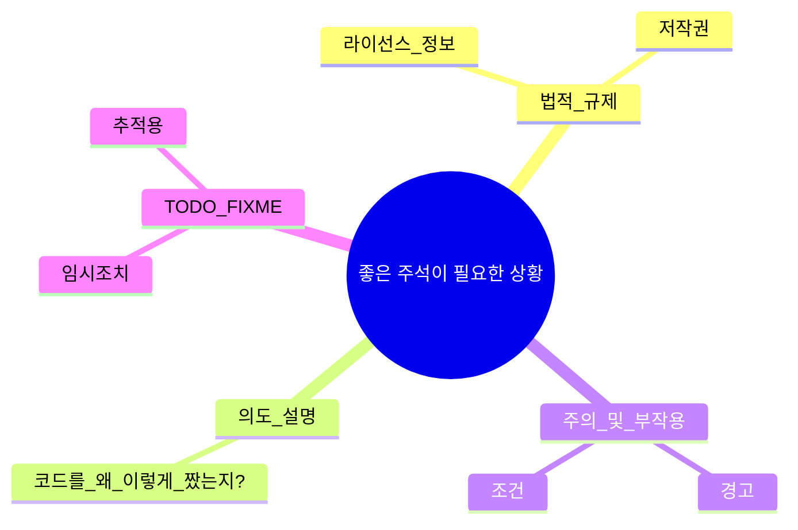

# 4장. 주석 (Comments)

> “나쁜 코드는 작성자의 사라짐과 함께 의미를 잃지만, 나쁜 주석은 잘못된 정보를 영원히 담고 있을 수 있다.” – 로버트 C. 마틴

> [!summary] 나의 요약  
> **4장**에서는 주석(Comments)을 어떻게 다루어야 하는지에 대해 중점적으로 설명합니다.  
> 로버트 C. 마틴은 “주석은 필요한 경우에만 사용”해야 하며, 가장 이상적인 상황은 “주석이 필요 없을 정도로 코드 자체가 명확”한 것이라고 강조합니다. 코드를 이해하기 위해 주석에 지나치게 의존하게 되면, 주석이 갱신되지 않는 순간부터 코드는 ‘오해의 연속’이 될 수 있기 때문입니다. 때문에 주석이 코드와 연동되어 있어서 코드가 수정되면 함께 동적으로 변경되면 어떨까? 라는 생각을 잠시 했지만 그 정도 기술이 갖춰진 상황이면 오히려 주석이 전혀 필요 없는 시대가 왔다는 뜻이겠죠. 코드를 자연어로 완벽하게 해석하는 기술이 생겼다면 당연히 주석의 필요성은 0에 수렴할 겁니다.
> 저자는 이런 불필요한 주석 코드를 줄이기 위해 소스 코드 관리 툴을 적극적으로 활용할 것을 강조하고 있는데, `git`이 개발자의 필수 도구처럼 언급되는 상황과는 다르게 현업에서는 이런 기본을 무시하는 사례가 왕왕 보입니다. 당장 아무 웹사이트나 들어가서 개발자 도구를 열어 보면 흔하게 접할 수 있죠. <u>아래 사진의 코드</u>를 주석 처리해서 남길 실용적인 이유가 과연 있을까요? `git`의 사용 방법과 원리를 숙지해야 할 필요성을 하나 발견한 거 같습니다.
>
> <center></center>
>
> 물론 법적·역사적·의도적 설명 등이 꼭 필요한 상황도 있지만, “주석으로 해결하기보다는 코드를 개선해 **자체 문서화**가 가능하게 하라”는 것이 이 장의 핵심 메시지라고 생각합니다. 계속 반복적으로 저자가 강조하는 것들이기도 하고 “실용주의 프로그래머”의 철학과도 정확히 일치합니다.

---

## 1. 들어가며

> 주석은 **“개발자의 의도나 힌트를 제공하는 수단”**이지만, 동시에 **“진실이 아닐 가능성”**을 내포하기도 합니다. 코드가 변경될 때마다 주석도 함께 수정되어야 하지만, 현실에서는 그렇게 되지 않는 경우가 많죠.  
> **“코드는 계속 진화하지만, 주석은 방치되기 쉽다.”** – 따라서 주석을 최소화하고, 코드를 더욱 명확히 작성해 주석에 대한 의존을 낮추는 것이 클린 코드의 중요한 원칙입니다.

---

## 2. 주석의 문제점

### 2.1 거짓말이 될 가능성

- 코드 수정 시 **주석을 함께 업데이트**하지 않으면, 코드와 주석이 불일치
- 오래된 주석은 독자에게 **잘못된 정보**를 주어 혼란을 야기

### 2.2 불필요한 중복 설명

- `count++; // count를 1 증가시킴` 같은 주석은 오히려 코드 가독성을 해침
- **의미 있는 변수명**과 **간결한 로직**이면, 굳이 주석으로 중복 설명할 필요가 없음

### 2.3 유지보수성 저하

- 주석도 일종의 “문서”이므로, 변경 사항이 생길 때마다 계속 관리 대상이 됨
- 주석이 많을수록, “중복 문서”를 유지보수해야 하는 부담이 커짐



---

## 3. 좋은 주석이 필요한 상황

### 3.1 법적·규제적 요구 사항

- 라이선스 정보, 저작권 표시, 필수 조항 등은 주석 형태로 명시가 필요할 수 있음

### 3.2 의도 설명 (Why)

- “왜 이렇게 작성했는가?”
- 코드만 봐서는 드러나지 않는 **배경 혹은 결정 과정**을 짧게 주석으로 달아둘 때 유용
- 예: “성능 문제로 인해 O(n^2) 알고리즘을 임시 사용함. 2주 내 개선 예정.”

### 3.3 주의(Warning)·부작용(계약 조건) 안내

- 특정 함수가 “사용 시 주의사항”이 있거나, “예외 조건”이 복잡할 때 간단한 경고를 남길 수 있음
- 예: “이 API는 내부 캐싱을 사용하므로, 호출 후 5초 이내에 변경 사항이 반영되지 않을 수 있음”

### 3.4 TODO / FIXME 주석

- 임시 작업, 긴급한 수정 필요 사항 등을 추적하기 위한 주석
- 단, **주석을 남긴 뒤 방치**하지 않도록, 추후 해결 혹은 이슈 트래커와 연동 권장



---

## 4. 불필요한 주석 줄이는 방법

### 4.1 코드 자체를 명확히

- **의미 있는 변수/함수/클래스 이름**
- 복잡한 로직은 작은 함수로 분리 (3장 함수 원칙과 연관)
- 코드만 봐도 “무슨 일을 하는지” 알 수 있다면, 자연스럽게 주석이 줄어듦

### 4.2 중복 설명 제거

- 이미 함수명이나 변수명으로 의도가 드러나는 내용을 **주석으로 반복**하지 않기
- `count++; // count를 1 증가` → 불필요

### 4.3 표현력 있는 구조

- **객체지향 모듈화**(클래스와 메서드 분리), 디자인 패턴 활용
- 로직에 따라 **메서드 체인** or **일관된 코드 스타일** 채택: 코드 자체가 “자체 문서화”

### 4.4 자동화 도구 활용 (Docstring, Javadoc 등)

- 언어/프레임워크에서 제공하는 **표준 주석 형식**을 사용하면, API 문서를 자동 생성 가능
- 문서화 주석(`/** ... */`, `///`, `"""`)을 관리하면 유지보수 시 코드와 문서가 동기화하기 조금 더 수월

---

## 5. 나쁜 주석의 예시

### 5.1 노이즈 주석

```java
// 이 클래스는 User를 모델링합니다.
public class User {
    private String name;
    // ...
}
```

- 클래스명 `User`가 이미 ‘User를 모델링’한다는 것을 드러냄 → 무의미한 주석

### 5.2 주석으로 숨기려는 나쁜 코드

```java
// 아래 코드는 3단계의 복잡한 절차를 수행하지만 변경하기가 어렵다.
// 그래서 다음 기능까지 우선 유지한다.
for (int i=0; i<list.size(); i++) {
   // ... 복잡한 로직 ...
}
```

- 주석에 “코드가 나쁘다”는 걸 고백하기보다는, **코드를 개선**해야 하는 신호

### 5.3 주석으로 “주석”을 설명

```java
/**
 * 이 함수는 DB에서 데이터를 가져옵니다.
 * 데이터를 가져온 후 가공합니다.
 * 마지막으로 리턴합니다.
 */
public Data getAndProcessData() { ... }
```

- 함수명(`getAndProcessData`)과 코드 로직이 이미 말해주는 사실을 장황하게 반복

---

## 6. 주석 관리 & 객체지향 관점

### 6.1 주석도 관리 대상

- 코드가 커질수록, **주석도 점검**해야 할 범위가 커짐
- **OOP 모듈화**를 잘하면, 클래스/메서드가 명확히 분리되어 주석이 필요한 범위를 최소화
- “한 클래스나 메서드가 작은 책임만 가질수록 주석 필요성도 낮아진다.”

### 6.2 의도와 맥락은 객체·함수 설계로 드러내기

- 주석으로 “이 함수는 DB 저장 & 알림 발송 & 로깅을 동시에 한다”고 설명하기보다는, **실제로 세 개 함수로 분리**
- **주석이 사라져도** 누구나 의도를 파악할 수 있는 **클린 코드 구조**가 이상적

---

## 7. 개인적인 생각: “주석 = 빚진 문서”?

> 주석을 “빚지고 있는 문서(Debt-like docs)”로 바라보면 어떨까요?
>
> - 코드는 시간이 지날수록 계속 변하고, 주석은 그 변화를 따라가야 합니다.
> - 즉, 주석 하나 작성할 때마다 **“이걸 나중에 갚아야 하는 문서 빚”**이 늘어난다고 생각하면, “차라리 코드를 개선해서 주석을 최소화해야겠다”는 동기가 생길 수 있습니다. 이건 개인적인 성향의 문제일 수도 있는데 제게 있어 문서는 정말 지루한 작업이고, 가능하다면 없는 게 나은 ‘필요악’ 같은 것이거든요.

---

## 9. 추가로 참고하면 좋을 자료

- **The Pragmatic Programmer** / Dave Thomas, Andy Hunt - 주석, 문서화, 자동화된 도구 활용 예시
- **Refactoring** by Martin Fowler – 코드 개선을 통해 주석을 줄이는 실제 기법

---
