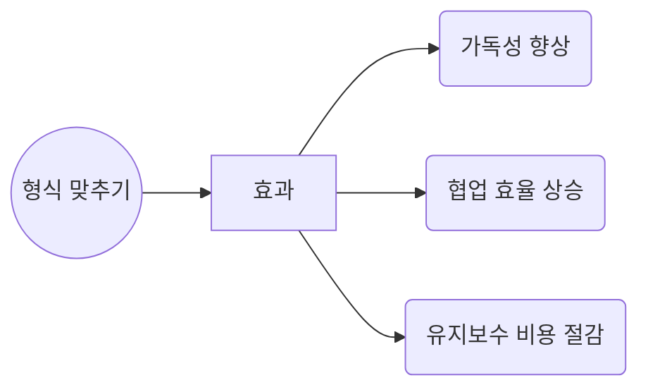

# 5장. 형식 맞추기 (Formatting)

> “코드는 한 편의 신문 기사처럼, 누구나 빠르게 훑어보며 핵심을 파악할 수 있어야 한다.” – 로버트 C. 마틴

> [!summary] 나의 요약  
> **5장**에서는 코드의 레이아웃과 스타일을 체계적으로 관리하는 ‘형식 맞추기(Formatting)’를 다룹니다.  
> 코드가 적절히 나뉘어 있고, 가독성 높은 스타일을 유지한다면, **찾기도 편하고 이해도 쉽습니다.** 저자는 “신문 기사처럼 코드를 배치하라”고 비유하며, 중요한 부분을 위쪽에, 세부적인 내용은 아래쪽에 배치하는 등의 **시각적 가독성** 원리를 제시합니다.
> (면접의 질문에 두괄식으로 답하라는 맥락과 유사합니다. 중요한 답변을 제시하고 그에 대한 세부적인 근거를 제시하면 청자의 입장에서 아주 명확하게 이해할 수 있습니다.)
> 특히 정형화된 포맷은 독자로 하여금 어디에 어떤 정보가 있다는 사실을 사전에 인지 시킬 수 있기 때문에 정보 전달에 아주 효과적입니다.
> 또, 팀 내 일관성 있는 컨벤션이 필요하다는 점도 강조합니다. 아무리 훌륭한 규칙이라도 혼자만 지키면 의미가 없으므로, 모든 팀원이 합의된 형식을 준수해야 합니다. 결국, **형식 맞추기는 단순히 ‘예쁘게 보이기’가 아니라, 협업과 유지보수를 돕는 중요한 기술**입니다.
> 같은 한국말이라도 문법과 단어가 다르면 이해하기 어려운 거처럼 이런 정형화된 규칙을 지키는 게 소통에 중요하다는 사실은 너무 당연한 이야기인 거 같습니다.

---

## 1. 들어가며

> “코드는 남들이 보기에도 깔끔해야 한다.”  
> 코드를 읽는 독자는 미래의 **나**이기도 하고, **팀 동료**이기도 합니다.  
> **한눈에 들어오는 구조**와 **일관성 있는 스타일**을 갖춘 코드는, 코드 리뷰와 유지보수 과정을 훨씬 수월하게 만들지요.

---

## 2. 왜 형식 맞추기가 중요한가?

### 2.1 가독성 향상

- 시각적으로 **줄바꿈**, **들여쓰기**, **공백** 등을 적절히 배치하면, 로직을 이해하기 쉬움
- 비슷한 개념이나 로직이 같은 블록, 같은 들여쓰기로 묶여 있으면 맥락 파악이 빠름

### 2.2 협업 효율 상승

- 팀원 간에 **형식이 달라** 매번 충돌(Coding Style Conflict)이 일어나면 리뷰 시간이 늘어남
- 통일된 스타일로 작성하면 코드 비교(추적, Diff) 시 불필요한 변경 부분이 줄어듦

### 2.3 유지보수 비용 절감

- 여러 사람이 오가며 수정해도 코드 스타일이 일관되면, **의도 파악**과 **문맥 전환**이 쉬움
- “깨끗한 형식”은 **리팩토링**이나 **기능 추가** 시 든든한 토대가 됨



---

## 3. 수직 형식 맞추기 (Vertical Formatting)

### 3.1 신문 기사 비유

- **핵심 개념**을 상단에 배치, 세부 사항을 아래로 배치하는 구조
- 코드를 **위에서 아래로** 읽으며 점진적으로 세부사항을 파악

### 3.2 빈 줄(Vertical Spacing)의 사용

- **관련된 코드 블록**끼리는 붙여서, 덩어리를 이루게 함
- **서로 다른 역할**을 하는 코드 블록 사이에는 빈 줄을 두어 명확히 구분

### 3.3 파일 크기 & 클래스 길이

- 하나의 파일(클래스)이 지나치게 길면, “무슨 책임을 맡고 있는지” 파악하기 어려움
- **단일 책임 원칙**(SRP)에 따라, 클래스를 분리해 “신문 기사처럼” 여러 개로 나누는 것을 고려

---

## 4. 수평 형식 맞추기 (Horizontal Formatting)

### 4.1 짧은 줄 유지 (Line Length)

- 가로로 너무 긴 코드 줄은 가독성을 해침(가로 스크롤 필요)
- 적절한 선에서 **개행**을 통해 줄을 분할 (일반적으로 80~120자 사이 권장, 팀 컨벤션에 따라 다름)

### 4.2 들여쓰기와 공백

- **연산자 사이**에는 공백을, **함수 인자 리스트**에서도 쉼표 뒤 공백 등을 일관성 있게 두기
- 중첩 블록이 많아질수록 **들여쓰기**로 구조를 시각화

### 4.3 정렬(Alignment) 지양

- 변수 선언 시 `=` 기호를 수평으로 맞추거나, 함수 파라미터를 열로 일렬 정렬하기보다는
- 일반적인 간격을 유지하는 편이 나중에 수정 시 편리함 (정렬이 깨지면 일괄 수정 부담)

---

## 5. 팀 컨벤션 & 자동화 도구 활용

### 5.1 합의된 스타일 가이드

- **Google Style Guide**, **Airbnb Style Guide**, 혹은 회사 내부 가이드를 참고
- 팀 전체가 같은 포맷터(Formatter)나 Linter를 사용하면 자동으로 스타일 통일

### 5.2 자동 포맷터 (IDE, 린터)

- IntelliJ, Eclipse, Visual Studio Code 등에서 제공하는 **자동 정렬 기능**, **ESLint/Prettier** 등으로 일관성 유지
- **커스텀 규칙**을 정의해두면, 개발자가 수동으로 정렬하는 시간을 절약 가능

### 5.3 코드 리뷰와 CI 파이프라인

- PR 생성 시 자동 포맷터를 돌려 “포매팅 불일치”를 미리 교정
- CI(지속적 통합) 단계에서 **스타일 검사**를 자동화하면, “포맷팅 논쟁”을 최소화

---

## 6. 객체지향 프로그래밍과 형식

### 6.1 모듈화된 구조 = 깔끔한 형식

- **SRP, OCP** 같은 OOP 원칙을 준수하면, 큰 파일 대신 작은 클래스/함수로 나눠지므로 자연스럽게 시각적 분량도 줄어듦
- 코드 베이스가 OOP로 잘 구성되면, 형식 맞추기가 한결 수월해짐

### 6.2 “신문 기사” 관점에서 클래스 설계

- 클래스(파일) 상단에 중요한 개념(필드, 주 생성자, 주요 메서드), 아래로 갈수록 세부 구현
- 필요 이상으로 노출된( public ) 메서드나 상수는 **정말** 필요한 것인지 재검토 → 코드를 “읽기 쉬운” 형태로 구조화

---

## 7. 예시: 나쁜 형식 vs 좋은 형식

### 7.1 나쁜 형식 예시

```java
public class OrderService {public void processOrder(){double sum=0;for(Order o:orders){sum+=o.getPrice();}
logger.info("sum:"+sum);
sendReceipt(sum);}public void sendReceipt(double sum){/* ... */}}
```

- **한 줄에 너무 많은 코드**가 몰려 있고, 들여쓰기/공백/줄바꿈 모두 불규칙
- 함수 간 구분이 명확하지 않고, `orders`가 어디서 왔는지도 불명확

### 7.2 좋은 형식 예시

```java
public class OrderService {

    public void processOrder(List<Order> orders) {
        double sum = 0;

        for (Order o : orders) {
            sum += o.getPrice();
        }

        logger.info("Total: " + sum);
        sendReceipt(sum);
    }

    private void sendReceipt(double totalPrice) {
        // ...
    }
}
```

- **적절한 줄바꿈**, **들여쓰기**, **공백** 활용으로 시각적 가독성 향상
- 각 함수가 **한 가지 역할**을 담당, 파라미터가 명시적으로 드러남

---

## 8. 개인적인 생각: “문서 레이아웃” vs “코드 레이아웃”

> 우리가 문서를 작성할 때도 **제목, 부제목, 문단, 줄바꿈** 등을 활용해 가독성을 높이듯, 코드도 마찬가지입니다.  
> 문서 레이아웃에서 “머리말(서론)” – “본문(자세한 내용)” – “결론” 순으로 배치하는 것처럼, 코드에서도 **사용자(호출자)가 가장 먼저 봐야 할 주요 메서드**는 상단에, 내부 구현 세부는 아래로 내려 배치할 수 있습니다.

즉, **코드 = 문서**라는 관점에서,

- **위에서 아래로** 개념을 펼치는 계층 구조
- **수평/수직 간격**으로 문단을 구분
- **객체지향적 모듈화**와 병행해 ‘소설처럼’ 읽히는 코드를 지향

이런 접근이 팀 내에 공유되면, “코드 읽기”가 부담이 아닌 **일종의 독서 경험**이 될 수 있습니다.

---

## 9. 추천 참고 자료

- **Google Style Guides**, **Airbnb Style Guide** (JS/TS) 등 – 실제 포매팅 규칙 사례
- **린트/포매터** 도구 (ESLint, Prettier, Checkstyle, Spotless, ktlint 등)
