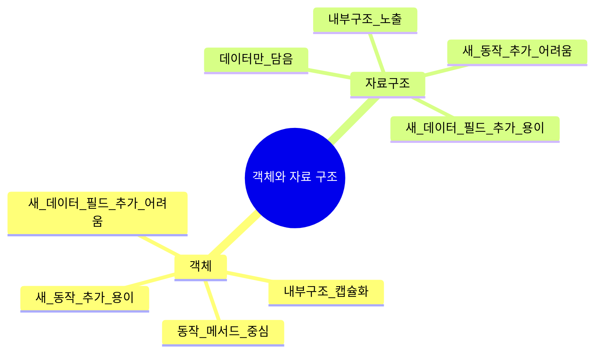
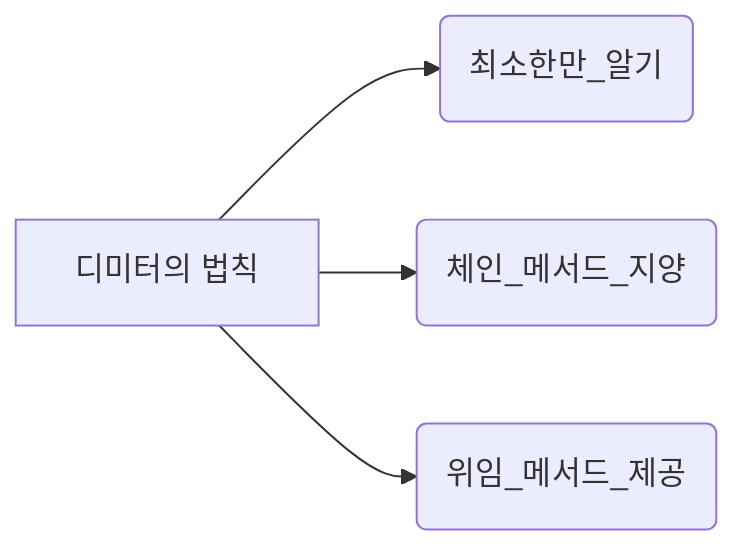

# 6장. 객체와 자료 구조

> “객체지향에서 중요한 것은 **행위(동작)와 데이터**가 적절히 결합해 ‘추상화’를 이룬다는 점이다.  
> 반면, 단순한 자료 구조는 **데이터를 담는 방식**에 집중하되, 별다른 행위를 제공하지 않는다.”  
> – 로버트 C. 마틴

> [!summary] 나의 요약  
> **6장**은 **객체 vs 자료 구조**라는 두 가지 관점을 비교하며, **자료 추상화**와 **객체 지향적 접근**이 가져다주는 이점을 강조합니다.  
> 저자는 “동작을 제공하는 객체”와 “데이터만 노출하는 자료 구조”를 구분짓고, 상황에 따라 ‘절차적 접근’과 ‘객체 지향적 접근’을 적절히 선택해야 한다고 말합니다.  
> 객체지향 설계를 할 때는 **추상화와 캡슐화**를 통해 사용자가 내부 구조를 알지 못해도 쉽게 다룰 수 있도록 만들어야 하며, “디미터의 법칙(Law of Demeter)”을 지키며 지나치게 내부 구조를 노출하거나 과도하게 연결되지 않도록 주의해야 한다는 것이 6장의 핵심 메시지입니다.

---

## 1. 들어가며

> **자료 구조(단순 구조체)**는 내부 데이터를 외부에 그대로 노출하고, 주요 로직은 다른 곳에서 처리하는 방식입니다.  
> 반면, **객체(추상화된 구조)**는 내부 구현을 감추고, 필요한 동작(메서드)으로만 조작하도록 함으로써 **캡슐화**를 달성합니다.  
> 6장은 이 둘의 차이점을 비교하며, 어느 쪽을 어떤 상황에서 택해야 하는지 설명합니다.

---

## 2. 객체 vs. 자료 구조

### 2.1 객체(Objects)

- **내부 구현(데이터 구조)**를 감추고, 공개 메서드를 통해서만 접근 가능
- **추상화**와 **캡슐화**가 핵심
- 동작을 제공하며, 의도치 않은 방법으로 데이터에 접근하는 것을 방지
- “새로운 동작 추가”에 강점이 있지만, “새로운 데이터 타입(필드) 추가”는 상대적으로 어려울 수 있음

### 2.2 자료 구조(Data Structures)

- 내부 필드를 **공개**하거나, 최소한 get/set 메서드를 통해 직접적으로 노출
- **단순히 데이터** 보관을 목적
- 별다른 동작(메서드)을 제공하지 않으므로, “새로운 데이터 필드 추가”는 쉽지만, “새로운 동작 추가”는 관련 코드를 모두 찾아 수정해야 하므로 어렵게 느껴질 수 있음

## 3. 자료 추상화

### 3.1 추상 데이터 타입(ADT)

데이터 표현 방식을 숨기고, 필요한 연산(인터페이스)만 노출
예: Stack, Queue, List 등은 내부 구현(배열, 연결 리스트 등)이 감춰짐

### 3.2 자료 구조를 지나치게 객체화하지 말라

무조건 클래스 안에 넣고, get/set만 있어도 “캡슐화가 잘 된 객체”라고 볼 순 없음
실질적인 추상화가 없이, 데이터 접근만 번거롭게 만드는 건 오히려 안 좋음
“악취 나는 자료 구조” = get/set만 잔뜩 들어가 있는 불필요한 캡슐화

### 3.3 “새로운 함수 vs. 새로운 자료 구조” 딜레마

함수(동작)을 자주 추가해야 하는 상황 → 객체(추상화) 중심이 유리
새로운 데이터 필드가 자주 추가되는 상황 → 절차적(자료 구조) 접근이 편할 수도

## 4. 디미터의 법칙 (Law of Demeter)

“모듈은 자신이 조작하는 객체의 속사정을 몰라야 한다” – 모듈 간 결합도를 낮추는 원칙

### 4.1 원칙

“최소한만 알아야 한다”:
객체가 협력할 때, 자기가 직접 가지고 있는 객체 혹은 메서드를 통해 간접적으로 접근하되, 연쇄적으로 속을 파고들지 않도록 제한
예: `a.getB().getC().doSomething()` 같은 체이닝(chaining)이 계속 이어지면, A가 B와 C의 내부까지 모두 알아야 하므로 결합도가 높아짐

### 4.2 적용

메서드 체인을 피하고, 필요한 동작을 바로 제공하는 “중간 메서드”를 설계 (위임)
객체 내부 구조에 대한 직접 노출을 줄이면, 유연성이 올라가고, 협력 객체가 변경될 때 파급 영향이 감소

## 5. 객체 지향 설계의 함정: 잡종(혼합) 구조

- 객체인 척하지만 실제로는 자료 구조에 가까운 클래스(혹은 그 반대)가 존재할 수 있음
  예: `public class Point { public double x; public double y; }` → 필드를 공개했으니 사실상 자료 구조
- 또는 `public class Data { private String field; public String getField()... }` 뿐이라면 실제 동작은 없고, Getter/Setter만 존재
  이러한 잡종 구조는 유지보수성과 캡슐화 측면에서 오히려 혼란을 줌

## 6. 결론: 언제 객체, 언제 자료 구조?

- **“행동 중심” + “데이터 보호”**가 핵심인 경우 → 객체로 설계
  내부 구조를 외부에 노출하면 안 되거나, 다양한 메서드를 통해 유연하게 조작해야 할 때
  단순히 데이터만 옮기거나, 기록/보관만 필요한 경우 → 자료 구조 사용
   
- DTO(Data Transfer Object), POJO(Plain Old Java Object), 레코드(Record)처럼 가볍게 쓰고 읽는 구조
- 중요한 점: 추상화를 통해 사용자가 내부 구조를 몰라도 쓸 수 있어야 한다는 것
  ADT나 객체 모두, 외부 코드가 내부 구현을 의존하지 않도록 함이 핵심
