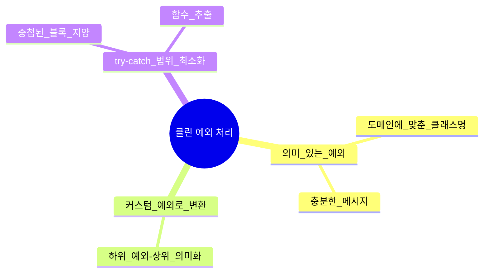

# 7장. 오류 처리(Error Handling)

> [!summary] 나의 요약  
> **7장**에서는 오류(예외) 처리 방식을 어떻게 해야 **클린 코드**의 원칙과 양립할 수 있는지 다룹니다.  
> 저자는 “깨끗한 코드”에서 **오류 처리**는 단순히 “에러를 잡아내는” 것을 넘어, **코드의 가독성과 안정성**을 동시에 보장해야 한다고 강조합니다. 함수를 깔끔하게 작성하듯, 예외 처리 구문도 흐름을 해치지 않도록 명확히 정리해야 하며, **의미 있는 예외**(커스텀 예외 클래스 등)를 사용하라고 조언합니다.  
> 또한, **예외에 대한 정보**(로그, 메시지)를 충분히 담아 “문제 해결”에 도움이 되도록 하고, **‘오류를 던지지 말고 코드를 깔끔히 정리’**하는 방법(예: null 반환 대신 옵셔널 패턴 등)을 고려해, 프로그램이 예측 가능하고 견고하게 동작하도록 만드는 것이 핵심입니다.

## 1. 들어가며

로버트 C. 마틴(Robert C. Martin)의 **클린 코드(Clean Code)** 7장에서는 **오류 처리**(Error Handling)에 대해 다룹니다.  
프로그램에서 오류나 예외가 발생하는 것은 자연스러운 일이지만, 이를 어떻게 처리하느냐에 따라 전체 코드 품질이 달라집니다.  
이 장에서는 “깨끗한 코드”를 유지하면서도 예외 상황을 어떻게 대응해야 하는지, **가독성**과 **안정성** 두 마리 토끼를 모두 잡을 수 있는 방법을 소개합니다.

> **핵심 개념**
>
> - **예외(Exceptions)**: 오류가 발생했음을 명확히 알리고, 정상 흐름과 분리해 가독성을 높이기 위한 수단
> - **의미 있는 예외 처리**: 단순히 예외를 던지거나 catch하는 데 그치지 않고, **정확한 맥락**(원인·상태·입력값 등)을 담아 디버깅과 유지보수에 도움을 주는 방식


---

## 2. 오류 처리의 중요성

### 2.1 프로그램 안정성 확보

- 오류가 발생했을 때, **제대로 처리되지 않으면** 전체 프로그램이 중단되거나, 예측 불가능한 동작이 일어날 수 있음
- 예외 처리를 통해 문제를 빠르게 감지·격리해 프로그램이 **안정성**을 유지하도록 함

### 2.2 코드 가독성과 유지보수성 향상

- 명확한 예외를 사용하면, “정상 흐름”과 “오류 흐름”이 분리되어 **코드 가독성**이 올라감
- 잘 설계된 예외 구조는 **장기 유지보수**에도 유리

### 2.3 디버깅 효율 증대

- 예외 메시지와 스택 트레이스를 통해 오류 원인을 빠르게 추적 가능
- 충분한 정보(입력값, 현재 상태 등)를 기록하면 **디버깅**에 큰 도움

---

## 3. 나쁜 오류 처리의 예시

### 3.1 무분별한 오류 코드 반환

```java
public double getUserBalance(String userId) {
    User user = userRepository.findById(userId);
    if (user == null) {
        // -1을 반환해 에러임을 표시
        return -1;
    }
    return user.getBalance();
}
```

- 에러 여부 확인을 위해 `-1` 같은 **특수 값**을 반환 → 가독성이 떨어지고, 호출자가 매번 분기 처리해야 함
- “-1”이 의미하는 바가 불분명해, 다른 곳에서 그대로 계산하면 의도치 않은 버그 유발

### 3.2 포괄적 Exception 남발

```java
try {
    // ...
} catch (Exception e) {
    e.printStackTrace();
}
```

- 모든 예외를 `Exception` 하나로 퉁치는 방식
- 어떤 상황에서, 왜 실패했는지 알 수 없어 디버깅이 어렵고 코드 구조도 복잡해짐

---

## 4. 예외를 깔끔하게 활용하는 방법

### 4.1 의미 있는 예외 클래스

- **특정 상황**을 정확히 나타내는 예외명을 사용 (예: `UserNotFoundException`, `InsufficientFundsException`)
- 메시지에 **맥락**(입력 값, 상태 정보 등)을 포함해 오류 파악이 용이하도록 함

### 4.2 커스텀 예외로 변환(Wrapper)

- 하위 계층(라이브러리)에서 발생한 예외를 **도메인 로직**에 맞게 변환해 상위 계층으로 전달
- 예: `SQLException` → `DataAccessException` → `UserRepositoryException` 등으로 의도에 맞게 래핑

### 4.3 예외 블록 최소화

- `try-catch` 범위를 최소화하여, **핵심 로직**과 **예외 처리** 로직이 분리되도록 작성
- 중첩된 try-catch는 함수 추출, 구조 재설계를 통해 개선



---

## 5. 예외와 정상 흐름 분리

### 5.1 예외는 진짜 “예외”적 상황에서만

- 코드 흐름 제어를 위해 예외를 남용하지 말 것
- “결과가 없을 수 있음” 정도라면 **Optional**(Java)이나 **Result**(타 언어)로 표현하는 편이 더 명확

### 5.2 복구 혹은 재시도

- 예외가 발생해도 상황에 따라 **재시도**나 **대체 경로**를 제공할 수 있다면, 깔끔하게 설계
- “파일 읽기 오류 → 백업 경로에서 재시도” 등

### 5.3 사용자 친화적 메시지

- “NullPointerException” 같은 용어보다, “잘못된 입력으로 사용자를 찾을 수 없습니다.”와 같은 **구체적**이고 **친절한** 메시지가 유지보수에 유리

---

## 6. 테스트와 예외 처리

1. **예외 시나리오**에 대한 단위 테스트 필수
   - 정상 시나리오만큼이나, 에러 발생 케이스도 테스트해 둬야 실제 운영환경 안정성 보장
2. **성능 테스트**
   - 대량 예외 상황(예: 대규모 잘못된 요청)이 들어올 때 서버 성능에 문제가 없는지 검증
3. **로깅 테스트**
   - 예외 처리 시 남기는 로그가 잘 찍히는지, 필요한 정보를 담고 있는지 확인

---

## 7. 구체적인 예시

### 7.1 나쁜 코드 → 좋은 코드

**(나쁜 예시)**

```java
public double getUserBalance(String userId) {
    User user;
    try {
        user = userRepository.findById(userId);
        if (user == null) throw new Exception("User not found");
    } catch (Exception e) {
        // 모든 예외를 똑같이 처리
        e.printStackTrace();
        return -1;
    }
    return user.getBalance();
}
```

**(좋은 예시)**

```java
public double getUserBalance(String userId) {
    User user = userRepository.findById(userId);
    if (user == null) {
        throw new UserNotFoundException("No user for ID: " + userId);
    }
    return user.getBalance();
}
```

- **의미 있는 예외**(`UserNotFoundException`)를 던지고, **-1 반환** 대신 직접 오류를 표출
- 호출 측에서 오류 상황을 명확히 구분해 처리 가능

## 8. 사례 보기기

### 8.1 디스코드 사례: 오류 처리에서 한 술 더 뜬 경고 처리

```log
2025-03-26 09:23:41,528 - verification_bot - INFO - Previous day verification check task ready
2025-03-26 09:29:51,019 - discord.gateway - INFO - Shard ID None has successfully RESUMED session 7831d7b32280504efd8485cee8cd4da9.
2025-03-26 10:00:06,634 - discord.gateway - WARNING - Can't keep up, shard ID None websocket is 41.6s behind.
2025-03-26 10:42:10,486 - discord.gateway - INFO - Shard ID None has successfully RESUMED session 7831d7b32280504efd8485cee8cd4da9.
2025-03-26 13:36:25,827 - discord.gateway - INFO - Shard ID None has successfully RESUMED session 7831d7b32280504efd8485cee8cd4da9.
2025-03-26 15:28:13,962 - discord.gateway - INFO - Shard ID None has successfully RESUMED session 7831d7b32280504efd8485cee8cd4da9.
2025-03-26 15:50:07,913 - discord.gateway - INFO - Shard ID None has successfully RESUMED session 7831d7b32280504efd8485cee8cd4da9.
2025-03-26 17:44:49,103 - discord.gateway - INFO - Shard ID None has successfully RESUMED session 7831d7b32280504efd8485cee8cd4da9.
2025-03-26 19:17:48,805 - discord.gateway - INFO - Shard ID None has successfully RESUMED session 7831d7b32280504efd8485cee8cd4da9.
2025-03-26 21:00:00,040 - verification_bot - INFO - Starting daily verification check (KST): 2025-03-26 22:00:00
```

```
+ 이어진 생각 = 좋은 기업에 가고 싶다면 좋은 기업의 사람들처럼 일하라 - 그냥 하는 말
```

### 8.2 Jira API와의 사투

```python
class JiraErrorCode(Enum):
    SUCCESS = 200
    BAD_REQUEST = 400
    UNAUTHORIZED = 401
    FORBIDDEN = 403
    NOT_FOUND = 404
    INTERNAL_SERVER_ERROR = 500
    SERVICE_UNAVAILABLE = 503

    @property
    def message(self) -> str:
        messages = {
            self.BAD_REQUEST: "잘못된 요청입니다",
            self.UNAUTHORIZED: "인증에 실패했습니다",
            self.FORBIDDEN: "접근 권한이 없습니다",
            self.NOT_FOUND: "리소스를 찾을 수 없습니다",
            self.INTERNAL_SERVER_ERROR: "내부 서버 오류가 발생했습니다",
            self.SERVICE_UNAVAILABLE: "서비스를 사용할 수 없습니다"
        }
        return messages.get(self, "알 수 없는 오류가 발생했습니다")

class JiraApiError(Exception):
    def __init__(self, status_code: int, message: str):
        self.status_code = status_code
        self.message = message
        super().__init__(self.message)

class JiraApi:
    def __init__(self):
        self.base_url = config.JIRA_URL
        self.headers = self._create_auth_headers()

    def _create_auth_headers(self) -> Dict[str, str]:
        auth_str = f"{config.JIRA_EMAIL}:{config.JIRA_API_TOKEN}"
        encoded_auth = base64.b64encode(auth_str.encode()).decode()
        return {
            "Authorization": f"Basic {encoded_auth}",
            "Content-Type": "application/json"
        }

    def _make_request(self, method: str, endpoint: str, **kwargs) -> Dict:
        url = f"{self.base_url}{endpoint}"

        try:
            response = requests.request(method, url, headers=self.headers, **kwargs)
            if response.status_code == JiraErrorCode.SUCCESS.value:
                data = response.json()
                logger.info(f"JIRA API 응답: {json.dumps(data, ensure_ascii=False, indent=2)}")
                return data

            error_message = response.json().get('errorMessages', ['알 수 없는 오류'])[0]
            error_code = JiraErrorCode(response.status_code)
            logger.error(f"JIRA API 에러 응답: {json.dumps(response.json(), ensure_ascii=False, indent=2)}")
            raise JiraApiError(error_code.value, f"{error_code.message}: {error_message}")

        except requests.exceptions.RequestException as e:
            logger.error(f"JIRA API 요청 실패: {str(e)}")
            raise JiraApiError(JiraErrorCode.SERVICE_UNAVAILABLE.value, "JIRA 서버 연결 실패")

```
