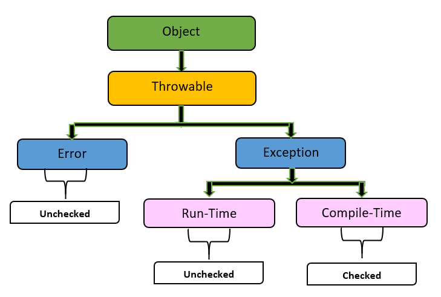

# 7장. 오류 처리

---
## 📍 REVIEW

예외처리는 프로그램 논리 상 중요한 작업이다. 프로그래머는 작성하는 프로그램에 대해 완결성을 부여할 의무가 있다. 의도한 바와 다르게 잘못 돌아가는 모든 가능성에 대해 통제하는 것이 완결성을 높이는 방법이고, 이는 예외 처리를 통해 가능하다. 그 과정에서 가장 중요하게 고민해야 하는 부분은, 오류 처리를 주요한 프로그램 논리와 “분리”하는 것이다. 거듭 강조되는 “기능에 따라 메서드를 분리하라”는 규칙에는 예외 처리도 포함되는 것이다.

## 📍 예외 처리를 “잘”하라

### 🔍 오류가 발생하는 즉시 처리하기

현재의 관점에서는, 과거 사용하던 ‘오류 코드’는 잊고 예외 처리를 어떻게 구현할 지에 대해 고민해야 한다. 예외가 지원되지 않던 시절에는 오류 코드를 주로 사용하였으나, 현재는 많은 언어가 예외를 지원하므로 예외 처리를 하는 방향이 낫다. 예외 처리를 하는 방향성은 아래 서술된 바로 하는 것을 권장한다.

#### ☑️ try-catch-finally 문을 사용하기

try-catch-finally문은 일전의 장에서 서술된 “하나의 기능을 하는 함수”의 조건은 위배하지만, 예외가 발생하는 로직에서는 최선의 해결책이 될 수 있다. Try 블록 안에는 수행하고자 하는 코드를 자유롭게 작성하고, catch 블록에서는 오류를 처리하고, finally 블록에서는 이후 실행될 동작을 작성한다.

각 블록의 역할을 보자. catch 블록은 try 블록에 무슨일이 생기든 프로그램의 상태를 일관성 있게 유지하기 위한 기능을 하고, finally 블록 또한 try-catch에서 어느 단계까지 실행됨과 무관하게 일관성 있는 역할을 한다.

try-catch-finally 블록은 테스트에서도 용이하다. 예외로 인해 테스트를 ‘실패’하도록 하기 보다는, 일단 예외처리를 통해 테스트를 성공하도록 구성한 뒤에 문제가 생긴 부분을 리팩토링 하도록 하는 방향성을 택할 수 있다.

#### ☑️ 확인된 예외보다는 미확인 예외로



위 사진은 JAVA에서 일어나는 예외에 대한 계층 구조이다. Checked Exception과 Unchecked Exception의 가장 큰 차이점은, 각각 컴바일 단계와 실행 단계에서 확인된다는 점이다. Checked Exception은 반드시 예외 처리를 해야만 하고, 만약 처리되지 않는다면 아예 실행 자체가 불가능하다. 반면, Unchecked Exception은 명시적인 처리를 강제하지 않는다.

결론부터 말하자면, Checked Exception(확인된 예외)는 지양해야 한다. 가능하다면 미확인 예외로 바꾸려는 노력을 해야 한다. 확인된 예외는 OCP를 위반하기 때문이다.

하위 단계의 함수에서 예외가 던져지도록 코드가 변경된 상황을 생각해보자. 이 경우, 이 함수를 사용하는 모든 상위 단계에서도 예외가 추가되도록 수정돼야 한다. 모든 상위에서 catch 블럭에 새로운 예외를 처리하거나, 선언부에 throw절이 추가돼야 한다. 확인된 예외는, 예외처리가 없다면 실행 자체가 불가능하기 때문이다.

의존성이 높은 Checked Exception보다는 Unchecked Exception이 발생되는 편이 유지보수 측면에서 유리하다.

### 🔍 감싸기 기법의 예외 클래스 활용하기

예외 클래스가 생소한 개념일 수 있으므로, 예외 클래스에 대해 먼저 설명하겠다. A 클래스에 대한 객체 B가 있을 때, B 객체에 대해 C 메소드를 실행한다고 가정하자. 만약 C 메소드 실행에 대해 다양한 예외가 발생할 수 있다면, B 객체를 생성하는 과정과 C 메소드 실행으로 일어나는 다양한 예외 발생을 모두 D 클래스로 묶을 수 있다는 것이다. 이 때, 클래스 D를 예외 클래스 라고 부른다.

예를 들어보자.

```java
ACMEPort port = new ACMEPort(12);

try{
   port.open();
}catch(DeviceResponseException e){
   reportPortError(e);
   logger.log("Device response exception", e);
}catch(ATM1212UnlockedException e){
   reportPortError(e);
   logger.log("Unlocked exception", e);
}catch(GMXError e){
   reportPortError(e);
   logger.log("Device response exception", e);
}finally{
   // ...
}
```

이 경우는 ‘ACMEPort’ 클래스의 객체 ‘port’가 ‘open()’이라는 메소드를 처리할 때 나오는 예외에 대해 처리하는 코드이다. 위 예시는 모든 예외를 잡아내긴 하나, 반복적인 처리가 많으며 모든 예외가 처리되는 방식이 유사하다. 이 코드를 감싸기 기법을 통해 예외클래스로 묶는다면 아래와 같다.

```java
public class LocalPort{
   private ACMEPort innerPort;
   
   public LocalPort(int portNumber){
      this.innerPort = new ACMEPort(portNumber);
   }
   public void open(){
	try{
	   port.open();
	}catch(DeviceResponseException e){
		throw new PortDeviceFailure(e);
	}catch(ATM1212UnlockedException e){
		throw new PortDeviceFailure(e);
	}catch(GMXError e){
		throw new PortDeviceFailure(e);
	}
   }
   // ...
}
```

이 경우는, ACMEPort 클래스에 대한 객체 생성, 그리고 open() 메소드 모든 예외에 대해 동일한 ‘PortDeviceFailure(e)’ 에러가 반환되는 과정까지가 감싸진 클래스이다. 이 클래스는 아래 예시대로 활용될 수 있다.

```java
LocalPort port = new LocalPort(12);
try{
   port.open();
}catch(PortDeviceFailure e){
   reportError(e);
   logger.log(e.getMessage(), e);
}finally{
   // ...
}
```

예외 클래스인 LocalPort로 객체를 생성하고, 메소드에 대한 모든 예외는 PortDeviceFailure로 처리된다. 이런 예외 클래스를 통해 프로그램과 라이브러리 사이의 의존성을 줄이고, 테스트 용이성도 높일 수 있다. 또한, 외부 api가 정의한 모든 예외에 대해 매번 처리하기보다는 프로그램이 사용하기 편리하도록 api를 정의할 수 있으므로 사용에 대한 용이성 또한 훨씬 높다.

## 📍 예외 처리가 없도록 하라

### 🔍 예외 상황의 캡슐화

깨끗하게 예외를 처리하는 것보다는 예외가 발생하는 상황 자체를 줄이는 것이 더 나은 해결책이라는 것은 명백하다. 이러한 맥락에서, 아주 특수한 상황에서 발생할만한 예외는 애초에 클래스/객체 단계에서 예외 상황을 캡슐화해서 처리하도록 하는 것이 용이하다. 즉, 특수한 상황은 예외로서 접근하지 않도록 태초에 정의하여, 실제 호출 시에는 정상적인 흐름을 갖도록 유도하는 것이다.

### 🔍 null 반환 및 전달 금지

null을 반환한다면, 호출하는 입장에서 null 확인 과정이 필수적으로 포함돼야만 한다.  한 번이라도 확인을 까먹으면 NullPointerException으로 인해 프로그램이 통제불능이 된다. null인지 확인하는 코드가 마구잡이로 사용되는 것은 비효율적일 뿐만 아니라, 모든 과정에서 확인과정을 거쳐야 하는 것이 번거롭다. null을 전달하는 것 또한 마찬가지다. 결국 메소드 위치에서 null인지 검사하는 로직이 무조건 실행되어야 하기 때문이다.

null을 사용하는 대신, 예외나 특수 사례 객체 반환으로 해결하도록 해야 한다.