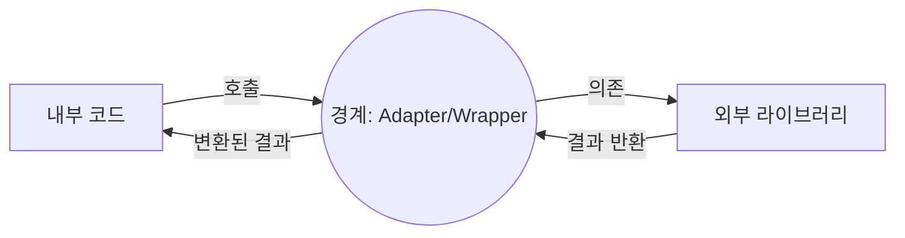
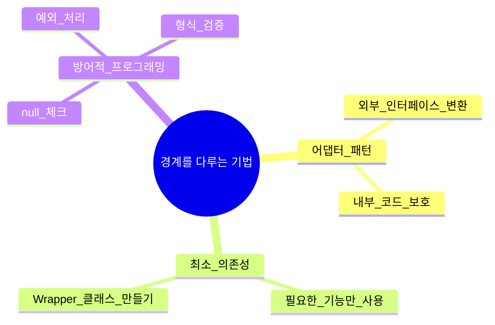

# 8장. 경계(Boundaries)

## 1. 들어가며

로버트 C. 마틴(Robert C. Martin)의 **클린 코드** 8장은 **경계(Boundaries)** 에 대해 다룹니다.  
여기서 “경계”는 우리가 작성하는 코드와 **외부 라이브러리**, **서드파티 API**, **오픈소스 프레임워크** 등 “내부가 아닌 것”과의 **접점**을 의미합니다.  
이 장은 **외부 코드**를 어떻게 안전하고 깔끔하게 통합할 것인지, 그리고 변경에 쉽게 흔들리지 않는 구조를 설계하는 방법을 강조합니다.

> **핵심 개념**
>
> - **경계(Boundary)**: 내 코드와 외부 요소(라이브러리, API, 모듈) 간의 접점
> - **안정된 내부 vs. 변화하는 외부**: 외부 요소의 변경이나 버전 업그레이드에 의해 코드가 무너지는 것을 방지하기 위한 **추상화** 및 **격리** 설계

아래 Mermaid 다이어그램은 “내부 시스템”과 “외부 라이브러리”가 어떻게 경계로 나뉘며, **중간 어댑터** 또는 **랩퍼**(wrapper)를 통해 상호 작용하는지 간략히 나타냅니다.



---

## 2. 왜 경계가 중요한가?

### 2.1 외부 변경에 대한 안정성

- 외부 라이브러리나 API는 **버전 업그레이드**, **호환성 문제**, **API 변경** 등이 발생할 수 있음
- 경계를 명확히 두면, 외부 변경이 **내부 로직 전반**을 뒤흔들지 않게 방어할 수 있음

### 2.2 코드 가독성과 유지보수성

- 외부 라이브러리의 복잡한 인터페이스를 **내부에서 직접 다루지 않고**, 경계에서 간결한 메서드로 추상화하면 내부 코드가 깔끔해짐
- 유지보수 시, 외부 요소를 교체하거나 업그레이드해도 경계 부분만 집중적으로 수정하면 됨

### 2.3 테스트 용이성

- 경계 인터페이스를 잘 정의해두면, **Mock**이나 **Stub**을 사용해 **외부 의존성**을 쉽게 대체 가능
- 통합 테스트(Integration Test)와 단위 테스트(Unit Test)를 명확히 분리해 **테스트 품질** 향상

---

## 3. 외부 라이브러리와의 경계 다루기

### 3.1 어댑터(Adapter) 혹은 래퍼(Wrapper) 패턴

- **외부 라이브러리**의 인터페이스가 우리 코드와 직접 맞물리지 않을 때, **중간 레이어**(어댑터)를 두어
  - 원하는 형식(메서드 시그니처, 데이터 구조)으로 변환
  - 라이브러리 변경 시 어댑터만 수정하면 되므로, 내부 로직 보호

### 3.2 “우리”가 통제할 수 없는 코드

- 오픈소스, 서드파티 API에 직접 의존할 때, **라이브러리 문제**가 곧 우리 문제로 전이될 위험
- 경계에서 **사용하지 않는 기능**이나 **불필요한 의존성**을 최소화하는 것이 좋음
- 필요하다면, 라이브러리가 제공하는 많은 기능 중 **우리가 사용하는 부분만** 정리해 **래퍼 클래스**를 만들 수도 있음

### 3.3 방어적 프로그래밍

- 외부 함수가 “예외”나 “null”을 던질 수 있음 → 경계에서 이를 처리하거나,
- “잘못된 데이터 형식”을 받을 수 있음 → 경계에서 **검증 로직**으로 방어



---

## 4. 외부 코드를 학습 테스트(Exploratory Test)하라

> **학습 테스트(Learning Test)**: 새 라이브러리나 API를 도입할 때, 실제로 작은 예제 코드를 짜서 동작 방식을 익히고, 그 결과를 확인하는 테스트

### 4.1 라이브러리 이해도 높이기

- 공식 문서만 보는 것보다, 간단한 테스트 코드를 작성해보면서 **특이 케이스**나 **경계 상황**을 확인
- 이 테스트 코드는 프로덕션 코드에 포함하지 않고, **문서 겸 실험 용도**로 남겨둘 수 있음

### 4.2 업데이트나 교체 시 재사용

- 라이브러리 버전이 올라가거나 새로운 API로 교체할 때, **학습 테스트**를 다시 돌려 문제가 생기는지 빠르게 확인
- 학습 테스트가 일종의 **“스모크 테스트”** 역할도 함

---

## 5. “동시다발적 적군 공격을 좁은 입구에서 막아내기” 비유

- 외부 라이브러리나 API가 **한꺼번에 변경**되거나, **동시에 복수의 라이브러리**가 업데이트되어 쳐들어온다고 상상해봅시다.
- 만약 우리 코드가 **넓은 평원처럼 모든 외부 요소와 직접 맞닿아** 있다면, 각 변경 사항마다 여러 부분을 여기저기 수정해야 해 방어(개발) 부담이 크게 늘어납니다.
- 하지만, **입구가 좁은 지점(경계·어댑터)**에서만 외부 변경을 맞이한다면, 변경이 아무리 많아도 **한 곳**에서 대응할 수 있어 내부 코드까지 대규모 수정이 퍼지지 않도록 제어할 수 있습니다.
- 이처럼 **좁은 입구**를 통해 적군(외부 요구사항)을 막아내는 전술은, 유명한 **테르모필레 전투**(300 vs. 대군), 장판파의 장비처럼 적의 수가 많아도 효율적으로 방어하는 구조와 유사합니다.

> **핵심 포인트**
>
> - 외부 변경이 다발적으로 발생해도, **경계 레이어**만 집중적으로 수정하면 됨
> - 내부 로직 전반을 뒤흔들지 않고, 코드 안정성을 유지
> - “외부 변화”가 “내부 대혼란”으로 이어지지 않도록, **한 지점**(어댑터/Wrapper)에서 만나는 전략

---

## 6. 테스트와 경계

1. **단위 테스트**(Unit Test)
   - 경계를 가짜 객체(Mock, Stub)로 대체해, **내부 로직**이 올바른지 확인
   - 외부 라이브러리가 불안정해도 안정적인 테스트 가능
2. **통합 테스트**(Integration Test)
   - 실제 라이브러리나 API를 호출, 경계 레이어가 올바르게 동작하는지 확인
   - 네트워크, DB, 파일 I/O 등 **실제 환경**을 고려
3. **회귀 테스트**(Regression)
   - 라이브러리 버전 업 시, 기존 테스트를 재실행 → 경계 레이어에 문제 발생 여부 빠르게 파악

---

## 7. 예시 코드

### 7.1 라이브러리 직접 호출(나쁜 예)

```java
public void sendMessage(String phoneNumber, String text) {
    ExternalSMSClient client = new ExternalSMSClient("apiKey");
    client.authenticate();
    client.sendSMS(phoneNumber, text, "UTF-8");
    // 나중에 ExternalSMSClient가 변경되면 여기 코드를 전부 수정해야 함
}
```

- **문제점**: 우리 코드가 라이브러리 `ExternalSMSClient`와 직접 결합
- 라이브러리 메서드가 바뀌면, 코드를 광범위하게 수정해야 할 수 있음

### 7.2 경계 어댑터를 둔 예시(좋은 예)

```java
public interface SMSService {
    void sendMessage(String phoneNumber, String text);
}

public class ExternalSMSAdapter implements SMSService {
    private ExternalSMSClient client;

    public ExternalSMSAdapter(String apiKey) {
        this.client = new ExternalSMSClient(apiKey);
    }

    @Override
    public void sendMessage(String phoneNumber, String text) {
        client.authenticate();
        client.sendSMS(phoneNumber, text, "UTF-8");
    }
}
```

- 우리 내부에서는 **`SMSService`** 인터페이스만 의존
- 실제 구현은 **`ExternalSMSAdapter`**를 통해 **라이브러리**와 연결
- 다른 SMS 라이브러리로 교체해도 `ExternalSMSAdapter`만 수정하면 됨

---
