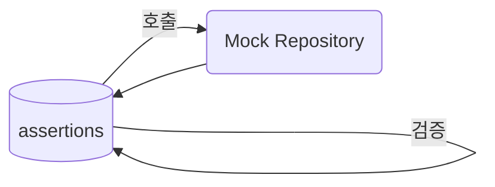

# 9장. 단위 테스트

> [!summary] 나의 요약  
> **9장**에서는 코드 품질을 지키기 위한 가장 강력한 수단 중 하나인 **단위 테스트(Unit Test)**를 다룹니다.  
> “테스트 코드는 생산 코드와 동일한 수준으로 관리되어야 한다”라는 저자의 메시지가 인상 깊습니다.  
> 아무리 잘 짜인 코드라도, 테스트가 부실하면 버그 발견이 늦어지고 유지보수가 어려워집니다.  
> 제 관점에서, 단위 테스트는 ‘코드를 미리 점검하는 소방 훈련’과 같다고 봅니다. 화재(버그) 상황이 발생하기 전에 미리 여러 시나리오를 가정해 대응 방식을 체크해두는 것이죠. 그러면 실제로 문제가 생겼을 때도 빠르게 원인을 찾고 피해를 최소화할 수 있습니다.

---

## 1. 들어가며

> **핵심 개념**
>
> - **단위 테스트(Unit Test)**: 작은 단위(함수, 클래스 등)에 대해, **예상 동작**을 검증하는 테스트
> - **테스트 코드 = 생산 코드만큼 중요**: 유지보수·가독성을 함께 관리
> - **FIRST 원칙**(Fast, Independent, Repeatable, Self-Validating, Timely): 좋은 단위 테스트가 지켜야 할 다섯 가지 특성

책에서는 단위 테스트가 개발 과정에서 의심 없이 거쳐야 할 필수 과정이라고 주장합니다.  
**코드 리팩토링**과 **지속적 통합(Continuous Integration)**을 가능하게 하며, “테스트가 없으면 클린 코드도 불가능하다”고까지 표현합니다.

---

## 2. 왜 단위 테스트가 중요한가?

### 2.1 버그 조기 발견

- 버그가 **코드 리뷰**나 **QA 단계**에서 발견되기보다, **개발 초기에** 찾는 편이 비용이 훨씬 저렴
- 단위 테스트는 개발자 스스로 **코드를 검증**하게 만들어, 오류를 조기에 포착

### 2.2 리팩토링 지원

- 테스트가 존재하면, 코드를 대대적으로 수정해도 **결과가 깨지지 않았는지** 빠르게 확인 가능
- “큰 변화”에도 자신 있게 도전할 수 있는 **안전망**

### 2.3 문서 역할

- 테스트 케이스를 보면, **함수/클래스의 의도**와 **입력-출력** 규칙이 명시적으로 드러남
- 과도한 주석 없이도, “이 함수는 이렇게 쓰라고 만들어졌구나”를 이해할 수 있음

---

## 3. 좋은 테스트 코드의 특징

책에서는 **FIRST 원칙**을 강조합니다:

1. **Fast (빠른 실행)**
   - 수백, 수천 개 테스트를 돌려도 빠르게 끝나야 CI에 부담이 적음
2. **Independent (독립성)**
   - 테스트 간에 순서나 공유 상태가 없어야, 어떤 순서로 돌려도 결과가 동일
3. **Repeatable (반복 가능)**
   - 어떤 환경(개발용·테스트용·CI 서버)에서도 예측 가능한 결과
4. **Self-Validating (자가 검증)**
   - 테스트 자체가 **성공/실패**를 확실히 드러냄 (“true/false” 등)
   - 로그만 찍거나 사람이 눈으로 판단해야 한다면 안 됨
5. **Timely (적시에 작성)**
   - 코드를 다 짠 뒤 나중에 억지로 테스트를 붙이기보다는, 코딩 과정에서 혹은 직후에 작성이 이상적

---

## 4. “단위 테스트는 소방 훈련” 비유

- **버그**를 화재에 비유하면, **단위 테스트**는 화재가 일어나기 전에 진행하는 **소방 훈련**과 같습니다.
- **소방 훈련**에서는 “불이 날 경우 어떻게 대처해야 하는지”, “소화기를 어디서 가져와야 하는지”를 미리 연습하죠.
- **단위 테스트**도 “만약 이상 입력이 들어오면 어떻게 처리해야 하는지”, “이 함수가 0값을 받으면 어떻게 동작하는지” 같은 시나리오를 미리 점검.
- 막상 버그(화재)가 터졌을 때, 이미 연습이 되어 있으니 **빠르고 정확하게** 문제를 해결할 수 있습니다. 정확히는 어디를 점검해야 하는지 빠르게 파악할 수 있죠.
- 소방 훈련이 없으면 **혼란**에 빠지듯, 테스트가 없다면 장애 발생 시 **어디서 무엇이 잘못됐는지** 찾느라 큰 비용이 들죠.

---

## 5. 테스트 코드도 클린하게

### 5.1 가독성 유지

- 테스트 메서드 이름에서 **시나리오**와 **기대 결과**가 드러나야 함
  - 예: `shouldReturnZeroWhenNoItems()`
- Given-When-Then 패턴으로 **명확히 단계**를 구분해 작성

### 5.2 중복 제거

- 반복되는 설정(예: Mock 생성, 공통 데이터) → `@BeforeEach` 또는 헬퍼 메서드
- 중복된 검증 로직 → 커스텀 어서션 메서드로 추출

### 5.3 단일 책임

- 테스트 하나가 **여러 기능**을 동시에 검증하면, 실패 시 어디가 문제인지 찾기 어렵
- 하나의 테스트는 **하나의 조건**과 **하나의 예상 결과**만 명확히 테스트

---

## 6. 테스트 주도 개발(TDD)

1. **Red–Green–Refactor**
   - 빨간 막대: 실패하는 테스트 작성
   - 초록 막대: 테스트가 통과하도록 최소한의 코드 작성
   - 리팩토링: 코드 개선, 테스트는 계속 초록 상태
2. **장점**
   - 기능 구현 전 테스트 요구사항을 먼저 적으니, **설계**가 명확해짐
   - 자연스럽게 **테스트 습관**을 기를 수 있음

_(물론 TDD가 아니더라도 자동화된 테스트 습관은 필수지만, TDD는 그걸 일상화하는 대표 방법입니다.)_

---

## 7. 테스트 더블(Test Double)과 Mock 활용

### 7.1 Mock, Stub, Fake

- **Stub**: 미리 정해진 응답을 반환해주는 객체
- **Mock**: 호출된 메서드나 파라미터를 검사해, 기대 대로 호출되었는지 확인
- **Fake**: 실제와 유사한 간단한 구현체 (예: 인메모리 DB)

### 7.2 외부 의존성 격리

- DB, 네트워크, 파일 I/O와 같은 느리거나 불안정한 요소를 **Mock**으로 대체
- 단위 테스트가 **독립**적이고 **빠르며** **일관된 결과**를 낼 수 있도록 함

## 8. 테스트 유닛 만들어보기(Python asyncio)

<i>디스코드 봇 기능 유닛 테스트</i>

