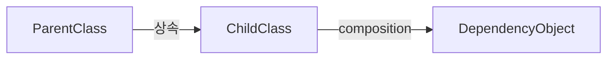

# 10장. 클래스

>[!summary] 나의 요약  
>**10장**에서는 **클래스(Classes)**를 어떻게 구성해야 클린 코드에 부합하는지 다룹니다.  
>저자는 클래스가 “객체지향 설계의 기본 단위”로서, **단일 책임(Single Responsibility)**을 지키고, **응집도(Cohesion)**를 높이며, **결합도(Coupling)**를 낮춰야 한다고 강조합니다.  
>저는 클래스를 ‘조직’에, 멤버 변수와 메서드를 그 조직에서 일하는 사람들에게 비유합니다. 조직이 너무 많은 일을 하거나 서로 다른 분야를 막 떠안으면 혼선이 생기듯, 클래스도 오직 ‘한 가지 책임’에 집중해야 가독성과 유지보수성이 높아집니다.

---

## 1. 들어가며

> **핵심 개념**  
> - **클래스는 객체지향 프로그래밍의 기본 단위**이자, **책임(Responsibility)을 담는 컨테이너**  
> - **하나의 클래스는 한 가지 일을 잘해야** 하며, 이 원칙을 어길수록 응집도가 떨어지고, 유지보수가 어려워짐  
> - **작고 명료한 클래스** 설계가 결국 전체 코드 품질을 좌우
> 
> 이 장에서는 “클래스를 어떻게 구성하면 클린 코드의 원칙을 적용할 수 있는가?”를 중점적으로 설명합니다.  
SOLID 원칙에서도 “S(Single Responsibility Principle)”가 가장 앞에 오는 이유를 다시금 되새기게 됩니다.

---

## 2. 클래스 설계의 중요성

### 2.1 객체지향 핵심
- 객체지향에서 모든 것은 클래스를 통해 이루어지므로, 클래스 구조가 곧 **코드 구조**를 결정  
- 클래스가 잘못 설계되면, 시스템 전반의 유지보수 비용이 증가하고 버그 발생률도 높아짐

### 2.2 팀 협업과 코드 확장성
- 많은 사람이 참여하는 프로젝트에서, “각 클래스가 명확한 책임”을 가지면 충돌이 줄어듦  
- 기능 추가나 수정 시에도 어디를 건드려야 할지 명확해지므로 **확장성**이 올라감

### 2.3 코드 재사용과 테스트 편의
- 작고 응집도 높은 클래스를 만들면, 다른 곳에서 **재사용**하기가 쉬움  
- 단일 책임을 가진 클래스는 테스트 시나리오도 단순해져, **테스트 코드 작성**이 편리

---

## 3. 클래스는 작게, 응집도는 높게

### 3.1 클래스 크기
- “한 클래스가 너무 많은 일을 하는 건 아닌지?”를 지속적으로 자문  
- **작은 클래스** 여러 개가 서로 협력하면, 한 클래스에 모든 기능을 몰아넣는 것보다 가독성이 높음

### 3.2 응집도(Cohesion)
- **클래스 내부 요소**(필드, 메서드)가 모두 서로 연관된 역할을 수행하는지 확인  
- 응집도가 떨어지면, “서로 연관 없는 코드 덩어리”가 한 클래스에 섞여 있어서 수정 시 혼란 발생

### 3.3 책임 분리 (SRP: Single Responsibility Principle)
- “이 클래스를 변경해야 하는 이유가 하나뿐이어야 한다”  
- 예: “사용자 정보를 관리”하는 클래스가 “UI 렌더링”까지 맡으면 안 됨

---

## 4. “조직과 부서에 비유”

- **클래스**를 하나의 **‘조직(Company)’**으로 생각할 수 있음  
- 이 조직에는 **“부서(Members, Methods)”**들이 존재, 서로 협력해 한 가지 목표(책임)를 수행  
- 만약 한 조직이 **제조도 하고, 마케팅도 하고, 회계도 하고, 공연 기획도** 한다면 혼선이 커지고 전문성도 떨어짐  
- 대신 **작은 부서(메서드 그룹)**가 명확히 나뉘어 있고, **하나의 조직(클래스)은 특정 분야**만 책임지면 효율 높음  
- 필요 이상으로 여러 분야를 섞어 운영하다 보면, 문제가 터졌을 때 **어디서 책임져야 하는지** 모호해지고, 전체가 복잡해짐

---

## 5. 클래스 설계의 일반 원칙

### 5.1 캡슐화(Encapsulation)
- 내부 구현(필드, 헬퍼 메서드 등)을 감추고, 외부에는 **공개 인터페이스**만 노출  
- 다른 클래스가 내부 세부사항에 의존하지 않도록 해야 결합도를 낮출 수 있음

### 5.2 인터페이스는 작게
- 공개 메서드(public) 범위를 최소화  
- 메서드를 줄이면, **사용자가 혼동할 가능성**도 줄고 유지보수에도 유리

### 5.3 “변경”에 대한 대비
- 클래스가 바뀔 때마다 너무 많은 곳에 영향을 미치지 않도록 **의존성 역전**이나 **인터페이스**를 적절히 활용  
- “이 클래스가 바뀔 일이 무엇인가?”를 미리 고민해 책임을 명확히 구분

### 5.4 테스트 친화적 구조
- 테스트가 용이하도록, **의존성 주입**(Dependency Injection), **Mock** 활용이 쉬운 설계를 지향

---

## 6. 클래스 간 관계와 의존성

### 6.1 상속(Inheritance) vs 구성(Composition)
- **상속**은 “is-a” 관계, 부모 클래스에 강하게 의존 → 주의 깊게 설계하지 않으면 결합도 증가  
- **구성(Composition)**은 “has-a” 관계, 내부에서 다른 객체를 사용 → 일반적으로 더 유연하고 재사용성이 높음

### 6.2 “은유” 대신 명확성
- **상속**을 단지 “편해서” 쓰는 대신, 진짜 “부모-자식” 관계가 맞는지 신중히 판단  
- 불필요한 복잡성 도입 없이, **단순화**를 우선



위 예시: ChildClass가 ParentClass를 상속하면서도,
별도 객체(DependencyObject)를 구성(Composition) 관계로 가지고 있는 상황

### 7. 예시 코드
#### 7.1 나쁜 예시: 복합적 책임을 가진 클래스
```java

public class UserManager {
    private DBConnection dbConnection;
    private File logFile;

    public void createUser(String name, int age) {
        // DB에 사용자 생성
        // 로그 파일 작성
        // 이메일 전송까지?!
    }

    public void renderUI() {
        // 콘솔 UI or Swing UI?
    }
    // ...
}
```

문제점: UserManager가 DB 처리, 파일 처리, UI 처리 등 무수히 많은 역할을 수행

수정해야 할 일이 생길 때마다 이 클래스만 변경하면 큰 영향이 발생

응집도가 낮고, 테스트하기도 복잡

#### 7.2 좋은 예시: 역할 분리
```java

public class UserService {
    private final UserRepository userRepository;
    private final NotificationService notificationService;

    public UserService(UserRepository userRepository, NotificationService notificationService) {
        this.userRepository = userRepository;
        this.notificationService = notificationService;
    }

    public void createUser(String name, int age) {
        User user = new User(name, age);
        userRepository.save(user);
        notificationService.sendWelcomeEmail(user);
    }
}
```

UserService는 “사용자 관리”에 집중

DB 저장 로직은 UserRepository에게, 이메일 등 알림은 NotificationService에게 책임 분산

각 클래스가 단일 책임을 가진 덕에 수정 및 테스트가 용이
